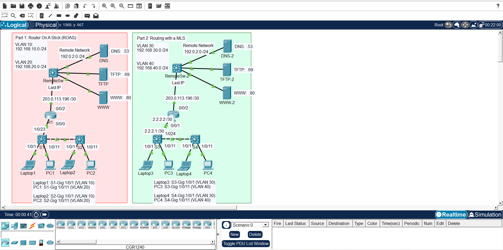

# Inter-VLAN Routing Configuration

## Objective
Enable communication between devices in different VLANs by routing traffic
between VLANs.

This Packet Tracer topology demonstrates inter-VLAN routing using a router
or Layer 3 device, allowing hosts in different VLANs to communicate.

## Environment
- Router or Layer 3 switch
- Multiple VLANs
- Packet Tracer lab environment

## Tasks Performed
- Created multiple VLANs
- Assigned switch ports to VLANs
- Configured inter-VLAN routing
- Verified connectivity between VLANs
